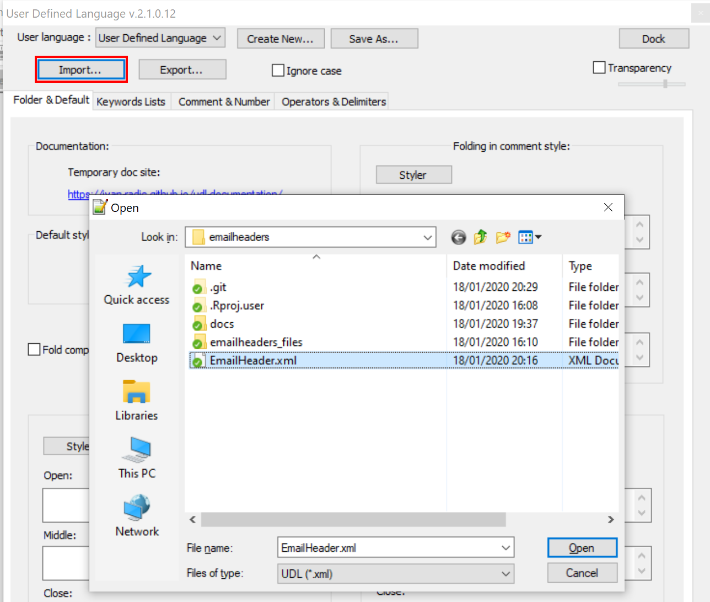

Notepad++ Email Header User Defined Language
================

#### References

  - 13Cubed Youtube Video [Email Header Analysis and Forensic
    Investigation](https://www.youtube.com/watch?v=nK5QpGSBR8c)
  - [13Cubed EmailHeader plugin forSublime
    Test](https://github.com/13Cubed/EmailHeader)
  - [User Defined Language for
    Notepad++](https://ivan-radic.github.io/udl-documentation/)

**Note: This file has been tested on Notepad++ 64bit v7.7.2.**

## Description

Thanks to **Richard Davis** author of the
[13Cubed](https://www.youtube.com/user/davisrichardg/) youtube channel
videos who gave us the [Email Header Analysis and Forensic
Investigation](https://www.youtube.com/watch?v=nK5QpGSBR8c) video, great
information, as are all of the other videos on his channel.

Richard created a email header highlighter plugin for Sublime Text. I
have created a similar keyword highlighter for Notepad++.

Based on what I need, I have configured four coloured highlights

  - Red: The main headers I need
  - Green: Microsoft X-Headers
  - Blue: Other X-Headers
  - Pink: Other Email Headers

It is easy enough to customise the **Email Header** highlighter if my
selections don’t suit your needs. The [User Defined Language for
Notepad++](https://ivan-radic.github.io/udl-documentation/) page will
help you. I have only used keyword lists.

## Email Header

This User Defined Language (UDL) **EmailHeader.xml** file will parse
.eml files or a file containing email headers for email message headers,
including x-headers.

## Highlighting IP Addresses in email headers

IPv4 and IPv6 addresses can be highlighted for ease of readability by
using Notepad++ Find and Mark capability.

1.  Click on **Search -\> Find** or **Ctrl F** to bring up the
    **Search** dialog.
2.  Click on the **Mark** tab
3.  Select the **Regular Expression** search mode
4.  Add either the IPv4 or the IPv6 regular expression in the **Find
    what:** text box
5.  Click **Mark All**

#### IPv4 IP address regex

    \b(25[0-5]|2[0-4]\d|1\d\d|[1-9]?\d)(\.(?1)){3}\b

#### IPv6 IP address regex

    (([0-9A-Fa-f]{1,4}:){7}([0-9A-Fa-f]{1,4}|:))|(([0-9A-Fa-f]{1,4}:){6}(:[0-9A-Fa-f]{1,4}|((25[0-5]|2[0-4][0-9]|1[0-9][0-9]|[1-9]?[0-9])(\.(25[0-5]|2[0-4][0-9]|1[0-9][0-9]|[1-9]?[0-9])){3})|:))|(([0-9A-Fa-f]{1,4}:){5}(((:[0-9A-Fa-f]{1,4}){1,2})|:((25[0-5]|2[0-4][0-9]|1[0-9][0-9]|[1-9]?[0-9])(\.(25[0-5]|2[0-4][0-9]|1[0-9][0-9]|[1-9]?[0-9])){3})|:))|(([0-9A-Fa-f]{1,4}:){4}(((:[0-9A-Fa-f]{1,4}){1,3})|((:[0-9A-Fa-f]{1,4})?:((25[0-5]|2[0-4][0-9]|1[0-9][0-9]|[1-9]?[0-9])(\.(25[0-5]|2[0-4][0-9]|1[0-9][0-9]|[1-9]?[0-9])){3}))|:))|(([0-9A-Fa-f]{1,4}:){3}(((:[0-9A-Fa-f]{1,4}){1,4})|((:[0-9A-Fa-f]{1,4}){0,2}:((25[0-5]|2[0-4][0-9]|1[0-9][0-9]|[1-9]?[0-9])(\.(25[0-5]|2[0-4][0-9]|1[0-9][0-9]|[1-9]?[0-9])){3}))|:))|(([0-9A-Fa-f]{1,4}:){2}(((:[0-9A-Fa-f]{1,4}){1,5})|((:[0-9A-Fa-f]{1,4}){0,3}:((25[0-5]|2[0-4][0-9]|1[0-9][0-9]|[1-9]?[0-9])(\.(25[0-5]|2[0-4][0-9]|1[0-9][0-9]|[1-9]?[0-9])){3}))|:))|(([0-9A-Fa-f]{1,4}:){1}(((:[0-9A-Fa-f]{1,4}){1,6})|((:[0-9A-Fa-f]{1,4}){0,4}:((25[0-5]|2[0-4][0-9]|1[0-9][0-9]|[1-9]?[0-9])(\.(25[0-5]|2[0-4][0-9]|1[0-9][0-9]|[1-9]?[0-9])){3}))|:))|(:(((:[0-9A-Fa-f]{1,4}){1,7})|((:[0-9A-Fa-f]{1,4}){0,5}:((25[0-5]|2[0-4][0-9]|1[0-9][0-9]|[1-9]?[0-9])(\.(25[0-5]|2[0-4][0-9]|1[0-9][0-9]|[1-9]?[0-9])){3}))|:))

## Installation

1.  Download the **emailheader.xml** form the github repository
2.  Open Notepad++
3.  Select **Language -\> User Defined Language -\> Define your
    Language…** 
4.  Select **Import** and load the file **EmailHeader.xml** and click
    **Open** 
5.  Close the **Define your Language…** dialog and close Notepad++.
6.  Start Notepad++ load your .eml file and the email headers should
    have highlighting
7.  Email Header highlighting for a text file containing email headers
    can be enabled by selecting **Language**, go to the bottom of the
    dropdown and select **Email Headers**

[EmailHeader.xml](EmailHeader.xml)

**This file has been tested on Notepad++ 64bit v7.7.2.**
